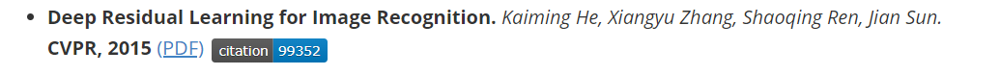
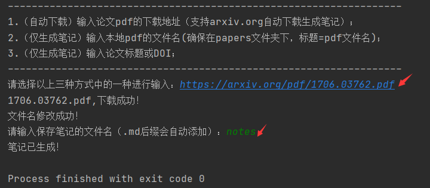
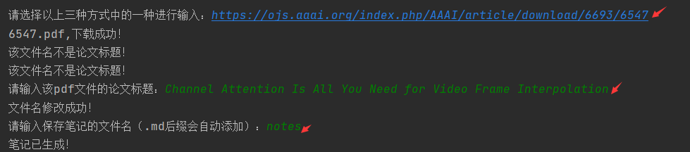
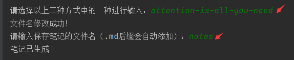
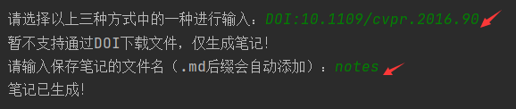

#  介绍
输入[arxiv.org](https://arxiv.org/)下载链接等，能够自动下载论文并将文件名修改为论文标题，通过[semanticscholar](https://www.semanticscholar.org/)提供的API查询到该论文的信息，自动生成一条markdown笔记。笔记内容包含论文标题，作者，发表地，发表年份，本地pdf文件的超链接，以及实时显示引用数的小图片插件，并且点击该插件能够自动访问该论文所在的[semanticscholar](https://www.semanticscholar.org/)网址。该图片插件通过[shields.io](https://shields.io/)生成。包含打包好的.exe文件，方便使用。

#  使用方法
- 依据打印的提示，按指定方式输入
    - 方式1：输入[arxiv.org](https://arxiv.org/)提供的pdf下载链接，即可自动下载pdf文件并生成笔记（pdf文件默认保存到当前目录的papers文件夹下）
    
    - 方式2：输入任意的pdf下载链接(可能需要手动输入论文标题)
    
    - 方式3：输入本地的pdf文件名（在papers文件夹下），确保文件名是论文标题（可含'-'作为空格），生成笔记的同时能够将pdf文件名修改为论文标题
    - 方式4：（仅生成笔记）输入论文DOI或论文标题
    
- 视频演示：施工ing
# To Do:
- [x] 给.md文件写入部分字符时，会产生乱码。
- [x] 实现给定链接自动下载且生成笔记(目前仅支持来自arxiv.org的自动下载)。
- [ ] 给定DOI自动下载且生成笔记(doi目前仅支持自动生成笔记)。

